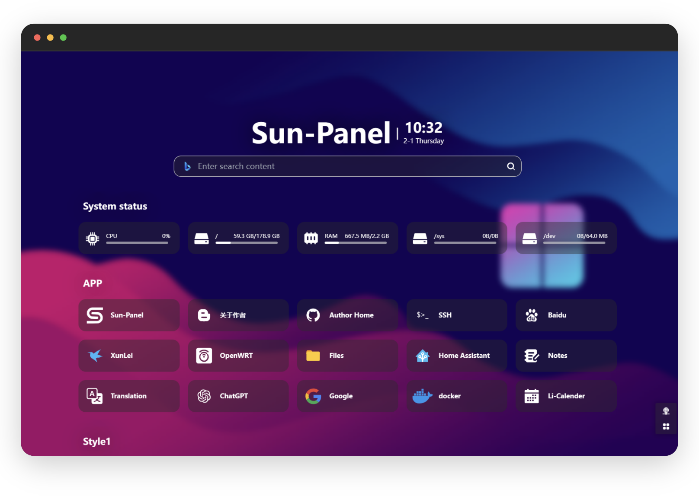

<div align=center>


# Sun-Panel on Cloudflare Worker

把 [Sun-Panel](https://github.com/hslr-s/sun-panel)（Vue 3 前端 + Go 后端）移植到 **Cloudflare Workers** 的单用户版本。

Worker (Hono) + D1 + KV + R2 + Vue 3

[](https://github.com/Bosco1262/Sun-Panel-on-Cloudflare-Worker)
[](https://github.com/hslr-s/sun-panel)

</div>

> [!NOTE]
> 本仓库是上游 [hslr-s/sun-panel](https://github.com/hslr-s/sun-panel) 的社区移植版本：
> 后端由 Go (Gin) + SQLite 改写为 Cloudflare Worker (Hono) + D1/KV/R2，前端沿用上游 Vue 3 代码并做适配。
> 上游 README 原文见 [docs/upstream/README.md](./docs/upstream/README.md)。



## ☁️ 技术栈

| 层 | 实现 |
|----|------|
| 后端 | Cloudflare Worker + Hono (TypeScript)，位于根目录 `src/` |
| 数据库 | Cloudflare D1 (SQLite) |
| 文件存储 | Cloudflare R2（头像、图片、文件上传，`/uploads/*` 由 Worker 代理） |
| 登录限流 | Cloudflare KV（同一 IP 10 分钟内最多失败 5 次） |
| 前端 | Vue 3 + Vite + Naive UI + Pinia（构建产物输出到根目录 `dist/`） |
| 鉴权 | JWT（jose，无状态，7 天有效期） |

## 🚀 快速开始

```bash
# 1. 安装依赖 (含 frontend workspace)
npm install

# 2. 复制环境变量
copy frontend\.env.example frontend\.env
copy .dev.vars.example .dev.vars

# 3. 初始化本地数据库
npm run migrations:apply:local

# 4. 启动开发环境
npm run dev        # 终端 1: Worker + 本地 D1/KV/R2 (http://127.0.0.1:8787)
npm run dev:web    # 终端 2: 前端热更新 (http://127.0.0.1:1002)
```

默认账号 `admin` / `12345678`，登录后可在「用户信息」中修改。

生产部署（Workers Git 集成 / 本地 wrangler）、常见问题与代码检查见 **[docs/deployment.md](./docs/deployment.md)**。

## 🗂️ 仓库结构

```
├── src/                     # Worker 后端源码 (Hono)
│   ├── api/                 # 路由: panel/ 与 system/ 分层，与前端 src/api/ 一一对应
│   ├── middleware/          # JWT 鉴权中间件
│   └── utils/               # 响应格式 / 密码 / JWT / 文件 / 系统设置
├── migrations/              # D1 数据库迁移
├── frontend/                # Vue 3 前端 (npm workspace)
├── dist/                    # 前端构建产物 (gitignored, 由 Worker 静态托管)
├── docs/                    # 项目文档 (部署、迁移计划、待办、上游资料)
├── reference/               # 上游源码对照副本 (gitignored, 不参与构建)
├── wrangler.toml            # Worker 配置 (D1/KV/R2/assets 绑定)
├── .dev.vars                # 本地开发环境变量 (gitignored, 模板见 .dev.vars.example)
├── package.json             # 根包: Worker 依赖 + 脚本 + frontend workspace
└── tsconfig.json            # Worker TypeScript 配置
```

## 📚 文档

| 文档 | 内容 |
|------|------|
| [docs/deployment.md](./docs/deployment.md) | 部署与本地开发完整说明 |
| [docs/migration-plan.md](./docs/migration-plan.md) | 从 Go 版迁移到 Worker 的设计与阶段计划（历史文档） |
| [docs/todo.md](./docs/todo.md) | 移植过程中收集的需求 / 待办清单 |
| [docs/upstream/README.md](./docs/upstream/README.md) | 上游原版 README（特性、截图、致谢） |
| [docs/upstream/CHANGELOG.md](./docs/upstream/CHANGELOG.md) | 上游更新日志 |

## 🔀 与上游 (Sun-Panel v1.3.0) 的差异

| 功能 | 说明 |
|------|------|
| 单用户 | 无多用户/注册/公开访客模式，账号信息存于 D1 `system_setting` |
| 系统监控 | 已移除（Worker 无法读取宿主机信息） |
| 图形验证码/邮件 | 已移除（仅密码登录） |
| 文件存储 | 本地磁盘 → R2（路径 `/uploads/*` 由 Worker 代理） |
| 站点图标 | 抓取后下载存至 R2（与手动上传的图标统一存放于 R2） |
| 鉴权 | 内存 Token → JWT (无状态, 7 天有效期) |
| 登录保护 | 验证码/邮件 → KV 级失败限流 (同一 IP 10 分钟内最多失败 5 次) |

> 前端构建产物统一输出到根目录 `dist/`，由 Worker 静态资源托管；`frontend/` 仅存放源码。

## 📄 License

[MIT](./LICENSE) © 2023 红烧猎人（上游作者）；本移植版本同样以 MIT 协议发布。
