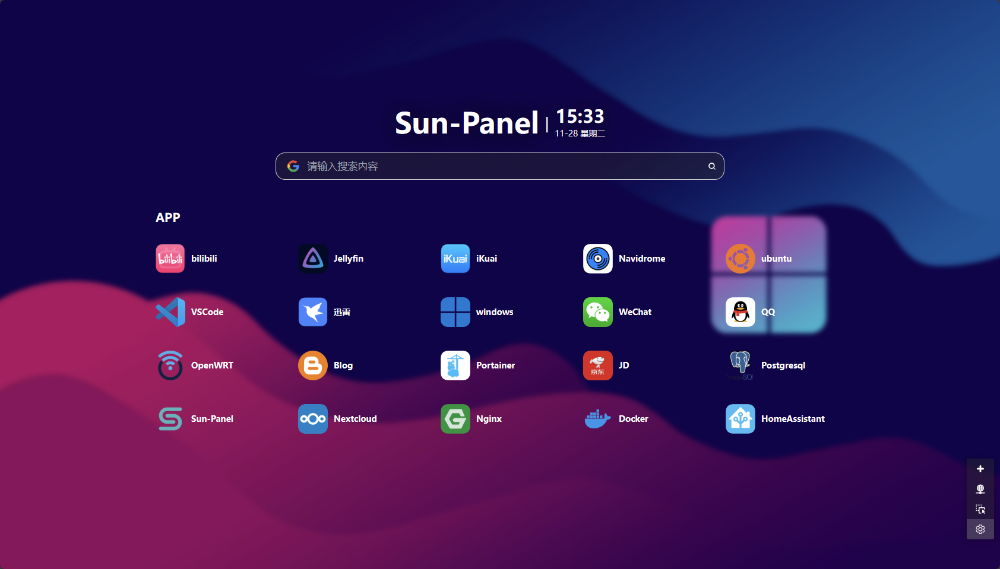
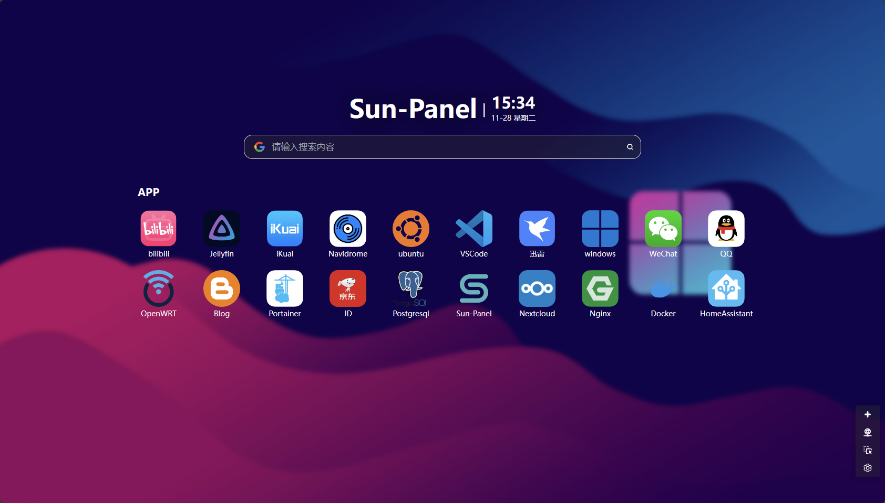
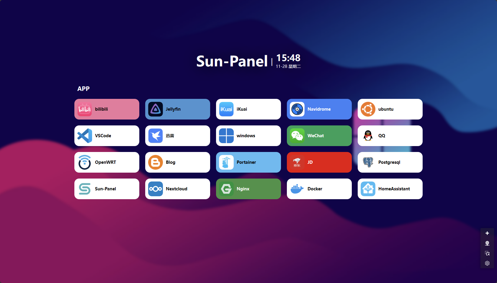
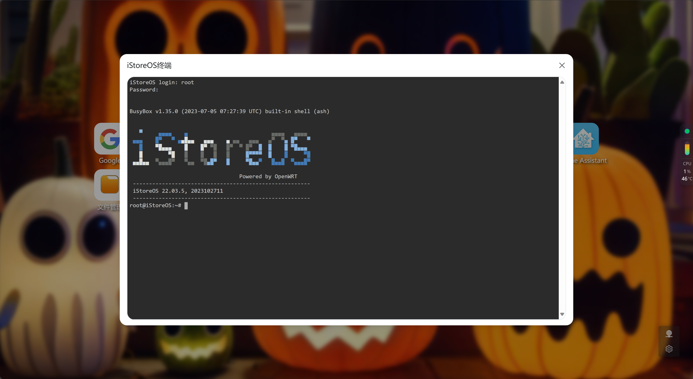

[[ 简体中文 ]](https://sun-panel-doc.enianteam.com/zh_cn/introduce/project.html) |
[[ English ]](https://sun-panel-doc.enianteam.com/introduce/project.html)

<div align=center>


# Sun-Panel

[](https://github.com/hslr-s/sun-panel)
[](https://gitee.com/hslr/sun-panel)
[](https://hub.docker.com/r/hslr/sun-panel) 
[](https://space.bilibili.com/27407696/channel/collectiondetail?sid=2023810)
[](https://www.youtube.com/channel/UCKwbFmKU25R602z6P2fgPYg)
<br>
[](https://github.com/hslr-s/sun-panel)
[](https://github.com/hslr-s/sun-panel/releases)
[](https://hub.docker.com/r/hslr/sun-panel)

[[ 中文文档 ]](https://sun-panel-doc.enianteam.com/zh_cn) |
[[ Document ]](https://sun-panel-doc.enianteam.com) |
[[ Demo ]](http://sunpaneldemo.enianteam.com) 

A server, NAS navigation panel, Homepage, Browser homepage.
<br>
一个服务器、NAS导航面板、Homepage、浏览器首页。

</div>


> [!IMPORTANT]
> In order to maintain the livelihood, the author added some [`PRO`] (https://pro.sun-panel.top) function, so the project temporarily entered a closed source state.; At present, the latest version of the open source is `v1.3.0`, [Please see the latest version of closed source](https://github.com/hslr-s/sun-panel/releases).; When the modular technology is developed, the separation of the PRO and the programs will be opened again, and the closed source will have no effect on ordinary users.; Let's look forward to open source again, and at the same time, we are welcome to supervise and review the security of the program.
> 
> 作者为了维持生计，增加了一些 [`PRO`](https://pro.sun-panel.top) 功能，所以项目暂时进入闭源状态。目前开源最新版本为`v1.3.0`，[闭源最新版本请查看](https://github.com/hslr-s/sun-panel/releases)。待开发出模块化技术，然后对PRO和主程序进行分离会再次开源，闭源对普通用户没有任何影响。我们一起期待再次开源吧，同时也欢迎各位大佬对程序的安全性进行监督和审查。

## 😎 Features

- 🍉 Clean interface, powerful functionality, low resource consumption
- 🍊 Easy to use, visual operation, zero-code usage
- 🍠 One-click switch between internal and external network modes
- 🍵 Supports Docker deployment (compatible with Arm systems)
- 🎪 Supports multi-account isolation
- 🎏 Supports viewing system status
- 🫙 Supports custom JS, CSS
- 🍻 Simple usage without the need to connect to an external database
- 🍾 Rich icon styles for free combination, supports [Iconify icon library](https://icon-sets.iconify.design/)
- 🚁 Supports opening small windows in the webpage (some third-party websites may block this feature)

## 🖼️ Preview Screenshots

**Various styles, freely combined**







**Built-in small windows**




## 🐳 Deployment tutorial
[Deployment Tutorial](https://sun-panel-doc.enianteam.com/usage/quick_deploy.html)

## ☁️ Deploy on Cloudflare (本仓库重构版)

本仓库已重构为标准的 Cloudflare Worker 仓库结构（单用户模式），可直接通过
[Workers Git 集成](https://developers.cloudflare.com/workers/git-integration/) 或本地 `wrangler` 部署：

- **后端**: 仓库根目录 `src/` 下的 TypeScript (Hono) Worker，替代原 Go 后端
- **数据库**: Cloudflare D1 (SQLite)
- **文件存储**: Cloudflare R2（头像、图片、文件上传）
- **登录限流**: Cloudflare KV（同一 IP 10 分钟内最多失败 5 次）
- **前端**: `frontend/` 下的 Vue 3 前端，构建产物输出到根目录 `dist/` 由 Worker 静态资源托管
- **默认账号**: `admin` / `12345678`（登录后可在「用户信息」中修改）

### 仓库结构

```
├── src/                 # Worker 后端源码 (Hono)
├── migrations/          # D1 数据库迁移
├── frontend/            # Vue 3 前端 (npm workspace)
├── dist/                # 前端构建产物 (gitignored, 由 Worker 静态托管)
├── wrangler.toml        # Worker 配置 (D1/KV/R2/assets 绑定)
├── .dev.vars            # 本地开发环境变量 (gitignored)
├── package.json         # 根包: Worker 依赖 + 脚本 + frontend workspace
└── tsconfig.json        # Worker TypeScript 配置
```

### 前置要求

1. 注册 [Cloudflare](https://dash.cloudflare.com) 账号
2. 安装 [Node.js](https://nodejs.org) 18+ 和 [Wrangler](https://developers.cloudflare.com/workers/wrangler/)：
   ```bash
   npm install -g wrangler
   wrangler login
   ```

### 方式一: Workers Git 集成 (推荐, 自动创建资源 + 自动迁移)

无需手动创建 D1/KV/R2，也无需本地安装 wrangler：

1. 进入 Cloudflare Dashboard → **Workers & Pages → Create → Import a repository**，
   选择本仓库（Worker 名称需与 `wrangler.toml` 中的 `name = "sun-panel"` 一致）
2. **Build command**: `npm run build`
   > 不要写成 `npm install && npm run build`：平台在执行构建命令前已经跑过 `npm clean-install`，
   > 再装一遍依赖会让构建白白多花几分钟（实测 install 阶段约 8 分钟）。
3. **Deploy command**: 
   ```bash
   npx wrangler deploy && npx wrangler d1 migrations apply sun-panel --remote
   ```
   - 部署时 wrangler (>= 4.45) 检测到配置中的 D1/KV/R2 资源不存在会**自动创建**并绑定
     ([自动资源供应](https://developers.cloudflare.com/changelog/post/2025-10-24-automatic-resource-provisioning/), Open Beta)
   - 构建环境自动注入 `CLOUDFLARE_API_TOKEN`，无需配置任何密钥即可执行迁移
4. 首次部署成功后，设置一次 JWT 密钥（Secret 无法由构建创建）：
   Worker → Settings → Variables and Secrets → 添加 `JWT_SECRET`（或本地执行 `npx wrangler secret put JWT_SECRET`）

之后每次 `git push` 都会自动构建、部署并应用新增的 D1 迁移。

> **环境变量无需入库**：`frontend/.env` 已被 `.gitignore` 排除，构建脚本
> `frontend/add-frontend-version.js` 在发现 `.env` 不存在时会用 `frontend/.env.example`
> 自动生成一份并写入 `VITE_APP_VERSION`，因此 Workers Build 不会因缺少 `.env` 而失败。
> 生产运行时只用到 `VITE_GLOB_API_URL=/api`，`VITE_APP_API_BASE_URL` 仅供本地 dev proxy，
> 默认配置可直接用于线上部署；如需覆盖，请在构建环境中配置对应的环境变量。

### 方式二: 本地 wrangler 部署

#### 创建云资源

> wrangler >= 4.45 支持自动资源供应：`wrangler.toml` 中未填写 id 时，`wrangler deploy` 会自动创建
> D1/KV/R2 并关联到 Worker，下列手动创建步骤仅为兼容旧版本，可选。

```bash
# 1. 创建 D1 数据库
npx wrangler d1 create sun-panel

# 2. 创建 KV 命名空间 (登录失败限流用)
npx wrangler kv namespace create sun-panel-login-rate

# 3. 创建 R2 存储桶
npx wrangler r2 bucket create sun-panel-files
```

手动创建后需将输出的 `database_id` 填入 `wrangler.toml` 的
`[[d1_databases]]`，将 KV 的 `id` 填入 `[[kv_namespaces]]`。

### 构建与部署

```bash
# 1. 安装依赖 (单次安装, 含 frontend workspace)
npm install

# 2. 构建前端 (输出到 dist/, 由 Worker 自动托管)
npm run build

# 3. 应用数据库迁移 (远程 D1)
npm run migrations:apply

# 4. 设置 JWT 密钥 (登录签名用)
npx wrangler secret put JWT_SECRET

# 5. 部署
npm run deploy
```

部署完成后访问输出的 URL（如 `https://sun-panel.xxx.workers.dev`），
使用默认账号 `admin` / `12345678` 登录。

> 也可执行 `npm run deploy:all` 一步完成「构建前端 + 部署」。

### 本地开发与测试

```bash
# 1. 安装依赖 (单次安装, 含 frontend workspace)
npm install

# 2. 复制前端环境变量 (仅需一次; CI 构建时会自动由 .env.example 生成)
copy frontend\.env.example frontend\.env

# 3. 应用本地数据库迁移 (首次)
npm run migrations:apply:local

# 终端 1: Worker + 本地 D1/KV/R2 模拟 (http://127.0.0.1:8787)
npm run dev

# 终端 2: 前端开发 (热更新, http://127.0.0.1:1002)
npm run dev:web
```

### 代码检查

```bash
npm run check   # 完整检查: Worker typecheck + 前端 typecheck + 前端 lint
npm run build   # 构建前端 (输出到 dist/)
```

> 说明: 前端开发服务器的 `/api` 与 `/uploads` 请求已通过 Vite 代理转发到 Worker
> (`frontend/.env` 中 `VITE_APP_API_BASE_URL=http://127.0.0.1:8787/`)。
> 若只想测试 Worker + 构建产物，可先执行 `npm run build`，然后直接访问 `http://127.0.0.1:8787`。
> 本地开发密钥在 `.dev.vars` 中 (`JWT_SECRET`)，生产环境请使用 `npx wrangler secret put JWT_SECRET`。

### 常见问题

**构建失败：`Error: ENOENT: no such file or directory, open '.env'`**

```
> sun-panel-frontend@1.3.0 add-version
> node ./add-frontend-version.js
Error: ENOENT: no such file or directory, open '.env'
```

原因：构建脚本 `frontend/add-frontend-version.js` 需要读写 `frontend/.env`，但 `.env` 被
`.gitignore` 排除，CI 克隆下来的仓库里只有 `.env.example`，脚本直接 `readFileSync` 即崩溃，
`run-p` 会连带中断 `type-check` 与 `vite build`。

解决：当前代码已修复——脚本检测到 `.env` 缺失时会先用 `frontend/.env.example` 生成一份，
再写入 `VITE_APP_VERSION`；同时 `build` 脚本改为先串行执行 `add-version`，避免 vite 读到
尚未更新版本号的 `.env`。升级到最新代码即可。

**构建耗时过长（install 阶段出现两次、共十余分钟）**

Workers Build 在执行构建命令前已经跑过 `npm clean-install`，Build command 再写一次
`npm install` 会重复装依赖。把 Build command 从 `npm install && npm run build` 改为
`npm run build` 即可。

### 与上游 (Sun-Panel v1.3.0) 的差异

| 功能 | 说明 |
|------|------|
| 单用户 | 无多用户/注册/公开访客模式，账号信息存于 D1 `system_setting` |
| 系统监控 | 已移除（Worker 无法读取宿主机信息） |
| 图形验证码/邮件 | 已移除（仅密码登录） |
| 文件存储 | 本地磁盘 → R2（路径 `/uploads/*` 由 Worker 代理） |
| 站点图标 | 抓取后下载存至 R2（与手动上传的图标统一存放于 R2） |
| 鉴权 | 内存 Token → JWT (无状态, 7 天有效期) |
| 登录保护 | 验证码/邮件 → KV 级失败限流 (同一 IP 10 分钟内最多失败 5 次) |

> 前端构建产物统一输出到根目录 `dist/`，由 Worker 静态资源托管；`frontend/` 仅存放源码。


## 🍵 Donate

> Open-source development is not easy. If you feel that my project has helped you, you are welcome to [donate](./doc/donate.md) or buy me a cup of tea☕ (please leave your nickname or name in the note if possible). Your support is my motivation, thank you.


<a href="https://www.paypal.me/hslrs">
</img> 
</a>


|   |   |
| ------------ | ------------ |
|  |   |

## 🏖️ Communication group & community

Author：**[红烧猎人](https://blog.enianteam.com/u/sun/content/11)**

[Github Discussions](https://github.com/hslr-s/sun-panel/discussions)

QQ交流群，进不去可以点上方连接联系作者


## ❤️ Thanks

- [Roc](https://github.com/RocCheng)
- [jackloves111](https://github.com/jackloves111)
- [Rock.L](https://github.com/gitlyp)


---

[](https://star-history.com/#hslr-s/sun-panel&Date)
