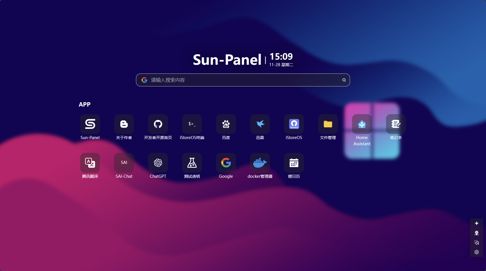
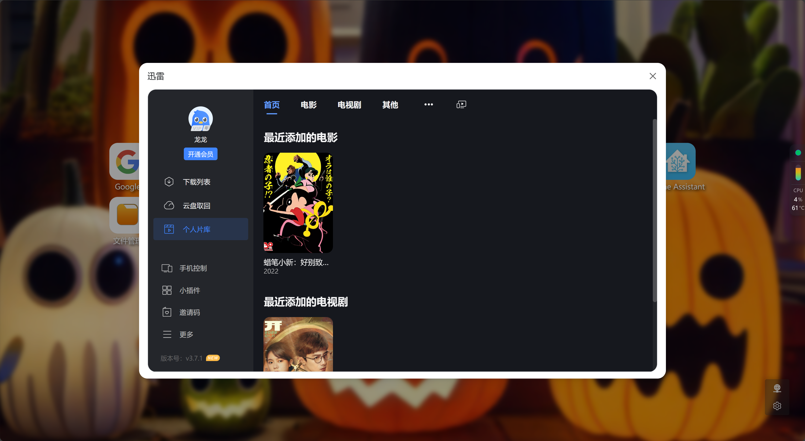

# Sun-Panel (archived upstream README)

[English](README.md) | [简体中文](README.zh-CN.md)

> This file archives the README of the upstream project [hslr-s/sun-panel](https://github.com/hslr-s/sun-panel) so the
> features and screenshots can be compared side by side.
> - Upstream repository: <https://github.com/hslr-s/sun-panel>
> - Upstream documentation: <https://doc.sun-panel.top>
> - About this port: [root README](../../README.md)
> - Upstream changelog: [CHANGELOG.md](./CHANGELOG.md) (archived up to v1.1.0 only; from v1.2.0 on, see the
>   "official release changelog" on the upstream documentation site)
>
> Notes: the original "Donate" section was removed because its images (`doc/donate.md`,
> `doc/images/donate/*.png`) were not carried over into this repository; image paths now point at this repository's
> [`../assets/`](../assets/); the upstream documentation site moved from `sun-panel-doc.enianteam.com` to
> <https://doc.sun-panel.top>, so the old domain links in the original text were replaced.
> This English file is a reading translation of the archive — the upstream original mixes English and Chinese
> (the Chinese reading version is `README.zh-CN.md` in this directory).

[[ 简体中文 ]](https://doc.sun-panel.top/zh_cn/introduce/project.html) |
[[ English ]](https://doc.sun-panel.top/introduce/project.html)

# Sun-Panel

 

[[ 中文文档 ]](https://doc.sun-panel.top/zh_cn) |
[[ Document ]](https://doc.sun-panel.top) |
[[ Demo ]](http://sunpaneldemo.enianteam.com)

A server, NAS navigation panel, Homepage, Browser homepage.
 
一个服务器、NAS导航面板、Homepage、浏览器首页。

> [!IMPORTANT]
> In order to maintain the livelihood, the author added some [`PRO`](https://pro.sun-panel.top) function, so the project temporarily entered a closed source state.; At present, the latest version of the open source is `v1.3.0`, [Please see the latest version of closed source](https://github.com/hslr-s/sun-panel/releases).; When the modular technology is developed, the separation of the PRO and the programs will be opened again, and the closed source will have no effect on ordinary users.; Let's look forward to open source again, and at the same time, we are welcome to supervise and review the security of the program.
>
> 作者为了维持生计，增加了一些 [`PRO`](https://pro.sun-panel.top) 功能，所以项目暂时进入闭源状态。目前开源最新版本为`v1.3.0`，[闭源最新版本请查看](https://github.com/hslr-s/sun-panel/releases)。待开发出模块化技术，然后对PRO和主程序进行分离会再次开源，闭源对普通用户没有任何影响。我们一起期待再次开源吧，同时也欢迎各位大佬对程序的安全性进行监督和审查。

## 😎 Features

- 🍉 Clean interface, powerful functionality, low resource consumption
- 🍊 Easy to use, visual operation, zero-code usage
- 🍠 One-click switch between internal and external network modes
- 🍵 Supports Docker deployment (compatible with Arm systems)
- 🎪 Supports multi-account isolation
- 🎏 Supports viewing system status
- 🫙 Supports custom JS, CSS
- 🍻 Simple usage without the need to connect to an external database
- 🍾 Rich icon styles for free combination, supports [Iconify icon library](https://icon-sets.iconify.design/)
- 🚁 Supports opening small windows in the webpage (some third-party websites may block this feature)

## 🖼️ Preview Screenshots

**Various styles, freely combined**

**Built-in small windows**

## 🐳 Deployment tutorial

[Deployment Tutorial](https://doc.sun-panel.top/zh_cn/usage/quick_deploy.html)

## 🏖️ Communication group & community

Author: **[红烧猎人](https://blog.enianteam.com/u/sun/content/11)**

[Github Discussions](https://github.com/hslr-s/sun-panel/discussions)

QQ group: contact the author through the link above (the group QR code image was not carried over into this repository).

## ❤️ Thanks

- [Roc](https://github.com/RocCheng)
- [jackloves111](https://github.com/jackloves111)
- [Rock.L](https://github.com/gitlyp)

---

